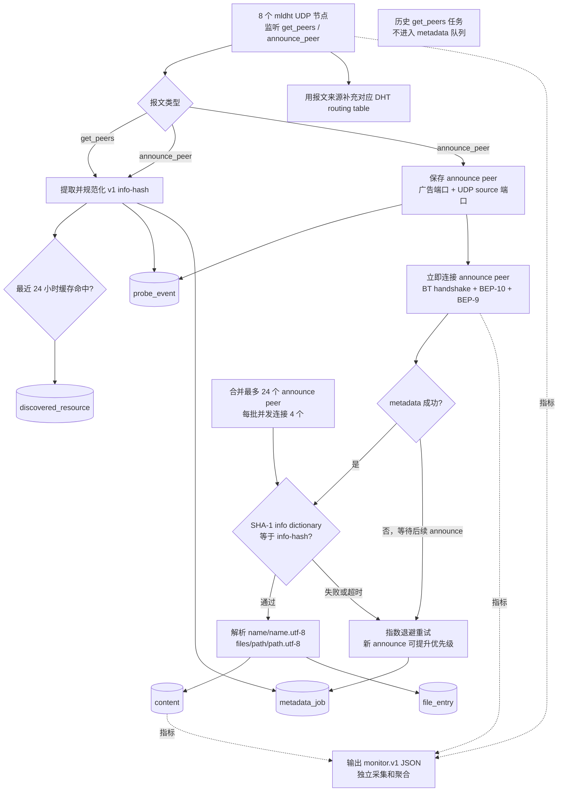
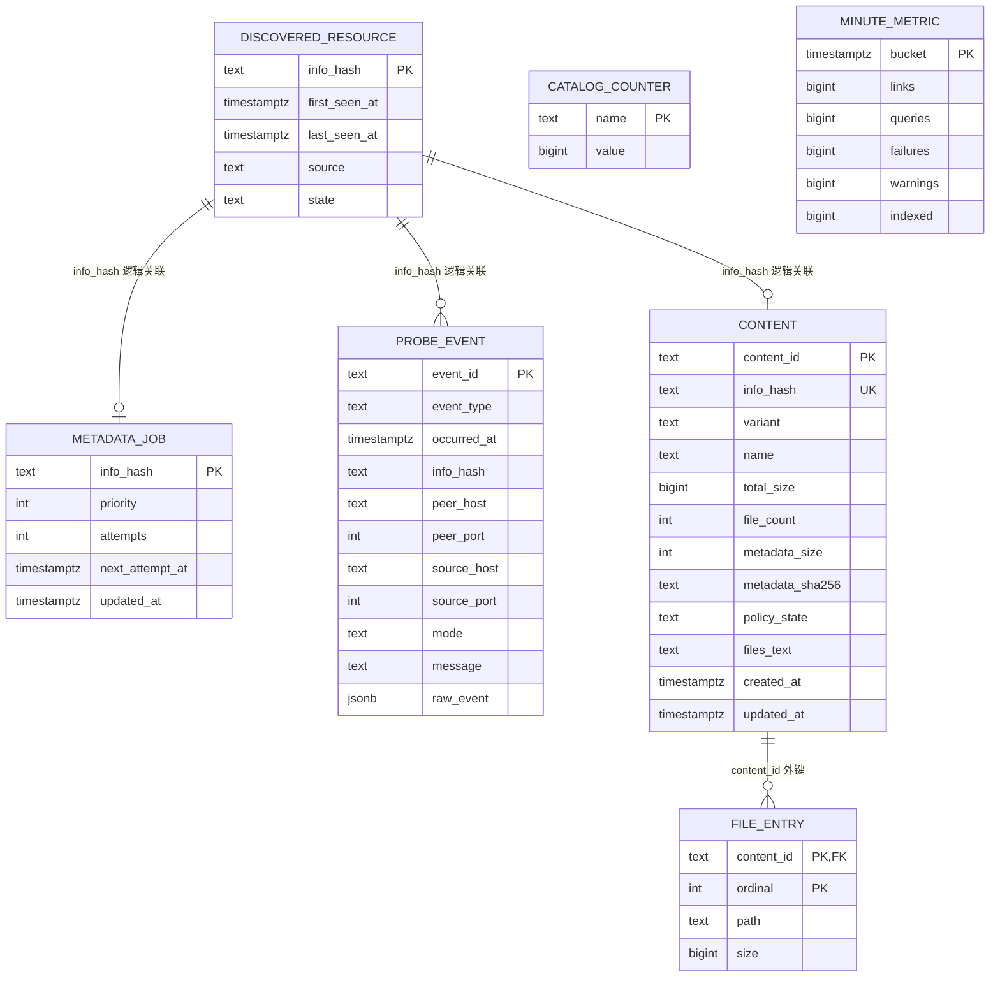
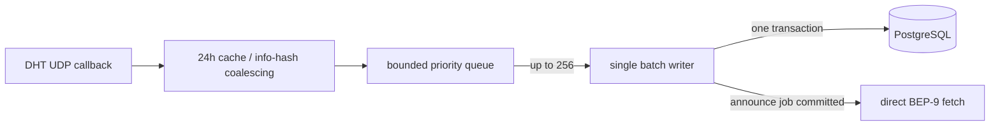

# DHT 种子名称采集原理与数据结构

本文描述 Java 版 `dht-collector` 当前实现。生产链路只发现 v1 info-hash、
获取并校验 BEP-9 metadata，不下载任何种子内容分片。

## 1. 名称到底从哪里来

Mainline DHT 的 `get_peers` 和 `announce_peer` 报文本身不包含种子名称：

- `get_peers` 提供 info-hash 和请求来源。
- `announce_peer` 额外提供一个当前 peer 的 TCP 端口。
- 名称、文件路径和文件大小来自 peer 返回的 BEP-9 `ut_metadata`。
- 收到 metadata 后，程序对原始 info dictionary 做 SHA-1；只有结果等于目标
  info-hash 才会解析名称并入库。

因此“更快获取种子名字”的核心不是增加数据库搜索速度，而是更快拿到仍在线、
支持 BEP-10/BEP-9 的 peer，并避免 DHT lookup 在单节点任务队列中饥饿。

## 2. 当前处理流程



### 2.1 快路径：`announce_peer`

1. 保存对方广告的 TCP 端口；由于 mldht 未暴露 BEP-5 `implied_port`，UDP
   source 端口作为第二候选。
2. 新任务以优先级 `100` 入库，并立即占用一个 metadata permit。
3. 对最多 12 个近期 announce endpoint 发起直接连接；单次仍受 24 个候选和 10 秒
   超时上限约束。
4. 成功后立即校验、解析并写入 `content`/`file_entry`；失败只保留受限重试，
   不创建新的 DHT lookup 图。

### 2.2 冷任务策略

1. `get_peers` 只用于发现资源和 DHT 路由，不自动创建 metadata 冷任务。
2. 历史 `metadata_job` 积压不被 collector 全表回放，避免旧任务拖垮实时 announce。
3. metadata 只从 announce_peer 提供的近期 endpoint 直接获取；失败等待新的
   announce 或受限重试。
4. 原有 DHT fallback 会在 mldht 内部保留 lookup 图，实测会产生
   `metadata.dht_lookup_saturated`，因此当前生产路径关闭。

### 2.3 并发和持久化

- `--max-concurrent=160`：限制 info-hash 观察处理。
- 生产 `--metadata-concurrent=16`：限制 metadata 工作总数。
- Java 21 virtual threads 承载阻塞式数据库和 TCP 操作。
- HikariCP 当前最多 5 条 PostgreSQL 连接，启用 TCP keepalive、1 分钟连接
  保活和 10 分钟最大生命周期。
- 只有最近 24 小时出现的 resource 常驻内存；更老的数据按需访问数据库。
- metadata job 在执行前持久化，进程重启后可继续；失败采用指数退避，最长
  7 天，新 announce 可重新加速。

## 3. 数据库关系



除 `content -> file_entry` 外，图中的 info-hash 关系是应用层逻辑关系，不是
数据库外键。这样高吞吐事件写入不会被大表外键检查放大。

## 4. 表结构与关键索引

| 表 | 用途 | 主字段 | 关键索引 |
| --- | --- | --- | --- |
| `discovered_resource` | info-hash 生命周期和去重 | `info_hash`, `first_seen_at`, `last_seen_at`, `source`, `state` | PK `info_hash`; `(state,last_seen_at)` |
| `metadata_job` | 可恢复 metadata 队列 | `info_hash`, `priority`, `attempts`, `next_attempt_at`, `updated_at` | PK `info_hash`; `(priority DESC,updated_at DESC,next_attempt_at)` |
| `probe_event` | 发现、peer、metadata 结果事实 | `event_id`, `event_type`, `occurred_at`, endpoint 字段, `raw_event` | `(occurred_at DESC)`; `(info_hash,occurred_at DESC)`; peer partial covering index |
| `content` | 已校验的种子级 metadata | `content_id`, `info_hash`, `name`, 大小/文件数, `files_text`, 时间 | unique `info_hash`; `updated_at`; 名称和文件文本 GIN |
| `file_entry` | 单文件路径和大小 | `content_id`, `ordinal`, `path`, `size` | PK `(content_id,ordinal)`; path GIN |
| `catalog_counter` | 避免 dashboard 实时全表计数 | `name`, `value` | PK `name` |
| `minute_metric` | 趋势图分钟聚合 | `bucket`, 五类计数 | PK `bucket` |

2026-08-14 的 PostgreSQL 统计估算：

| 表 | 估算行数 | 含索引总大小 |
| --- | ---: | ---: |
| `content` | 87,022 | 367 MB |
| `file_entry` | 3,172,271 | 1,155 MB |
| `discovered_resource` | 2,036,099 | 580 MB |
| `metadata_job` | 1,895,738 | 619 MB |
| `probe_event` | 7,376,786 | 4,669 MB |

这些数字解释了为什么 dashboard 必须读取 `catalog_counter`/`minute_metric`，
不能在请求时对事实表执行全表 `count(*)`。

## 5. 脱敏数据示例

以下样例保持实际字段形态；hash 已截断，peer 使用文档保留地址。

### `discovered_resource`

```json
{
  "info_hash": "1e8b4ea9...",
  "first_seen_at": "2026-08-14T13:39:35Z",
  "last_seen_at": "2026-08-14T13:39:50Z",
  "source": "announce_peer",
  "state": "active"
}
```

### `metadata_job`

```json
{
  "info_hash": "1e8b4ea9...",
  "priority": 100,
  "attempts": 1,
  "next_attempt_at": "2026-08-14T13:39:55Z",
  "updated_at": "2026-08-14T13:39:50Z"
}
```

### `probe_event`

```json
{
  "event_id": "5aa844bc-...",
  "event_type": "dht.peer_discovered",
  "occurred_at": "2026-08-14T13:39:50Z",
  "info_hash": "1e8b4ea9...",
  "peer_host": "198.51.100.24",
  "peer_port": 51413,
  "source_host": "198.51.100.24",
  "source_port": 49001,
  "mode": "passive"
}
```

### `content`

```json
{
  "content_id": "btih:1e8b4ea9...",
  "info_hash": "1e8b4ea9...",
  "variant": "v1",
  "name": "Some Kind Of Heaven (2020) [720p] [WEBRip] [YTS.MX]",
  "total_size": 797357436,
  "file_count": 3,
  "policy_state": "approved",
  "created_at": "2026-08-14T13:39:51Z"
}
```

### `file_entry`

```json
[
  {
    "content_id": "btih:1e8b4ea9...",
    "ordinal": 0,
    "path": "Some.Kind.Of.Heaven.2020.720p.WEBRip.x264.AAC-[YTS.MX].mp4",
    "size": 797217021
  },
  {
    "content_id": "btih:1e8b4ea9...",
    "ordinal": 1,
    "path": "Some.Kind.Of.Heaven.2020.720p.WEBRip.x264.AAC-[YTS.MX].srt",
    "size": 87189
  }
]
```

## 6. 本次性能诊断与改动

2026-08-14 采样的最近 30 分钟内：

- 收到 45,681 个 DHT 查询，发现 7,880 个新 info-hash。
- direct metadata 成功 15 次、miss 1,309 次。
- 发起 2,658 次 DHT fallback，`TorrentFetcher` 仅完成 1 次。
- 最终新增 17 条 `content`，成功率明显受 peer 可用性和 lookup 调度限制。
- PostgreSQL 曾发生约 68 秒连接中断，造成 217 次连接池等待超时。

代码检查确认，旧实现的独立 `PeerLookupTask` 每次都选择列表中的第一个 DHT
节点。该节点同时被声明为 `TorrentFetcher` 的专用节点，结果是独立 lookup
持续占据 task queue，而 `TorrentFetcher` 又要求该 queue 为空，二者互相影响。

本次改动：

1. 节点 0 只供 `TorrentFetcher` 使用。
2. 独立 lookup 在节点 1..11 之间轮询，并在当前节点不可用时继续尝试后续节点。
3. 新增 `metadata.dht_tasks_active`、`metadata.dht_tasks_queued` 指标，用于验证
   task manager 是否继续积压。
4. PostgreSQL 池增加 TCP keepalive、1 分钟 Hikari keepalive、10 分钟连接
   生命周期和 3 秒 validation timeout。

部署后至少观察 30 分钟，并比较：

- `metadata.dht_library_completed / metadata.dht_fetch_started`
- `metadata.dht_direct_completed / metadata.dht_fetch_started`
- `content.indexed` 每分钟增量
- `metadata.dht_tasks_queued` 是否持续增长
- `collector.failed` 和连接池 timeout 是否归零

若轮询分片后依旧没有 DHT peer 回调，下一步只对 priority `100` 的实时任务做
双节点 hedged lookup；不要先全局增加 metadata concurrency，否则只会扩大 UDP、
TCP 和数据库压力。

### 6.1 入站削峰与失败 Peer 惩罚

线上加速后，`announce_peer` 直取已经成为主要成功来源，但一次 PostgreSQL I/O
抖动仍让 5 个 collector 连接全部被占用。旧路径中每个 DHT 回调都会独立申请
连接并写 `discovered_resource`、`metadata_job` 和 `probe_event`，所以连接池等待会
反向阻塞网络观察任务。

当前入站路径调整为：



- 队列容量为 `max(2048, max-concurrent * 64)`；生产 `max-concurrent=160` 时为 10,240。
- 相同 info-hash 在队列中合并，`announce_peer` 会升级并移动到队首。
- 队列满时先淘汰最早的 `get_peers`；只有全部都是 announce 时才淘汰最早 announce。
- 数据库失败时整批回队并退避 500ms，避免每个观察各自等待连接。
- 观察批次为 64 条，缩短 `probe_event`/资源写入事务；
  `collector.observation_queue_depth`、`collector.observation_dropped` 和
  `collector.observation_retry` 用于监控削峰效果。

直接 Peer 获取还维护一个 `(info-hash, peer endpoint)` 短期负缓存。连接失败暂停
5 分钟，不支持扩展协议或反复拒绝 metadata 暂停 15 分钟，返回错误 info-hash
暂停 30 分钟。这样 direct miss 进入 DHT fallback 后不会立即重拨同一个坏 Peer，
同时不会因为一个种子失败而屏蔽该 Peer 上的其他种子。失败阶段通过
`metadata.peer.*` 监控日志发送到 Monitor Center。

连接超时根据候选数自适应：少于 4 个候选时保留 3 秒，避免错过唯一的新鲜
announce Peer；达到 4 个候选时单连接上限降为 1.5 秒，通过并行候选更快跳过
不可达地址。

BEP 51 `sample_infohashes` 仍保持关闭。当前 mldht 依赖已经支持该 RPC，但它扩大
的是发现覆盖面；应先验证批量写入在至少 24 小时内没有队列增长或连接池超时，
再考虑用一个独立 DHT 节点低速采样。

### 6.2 当前验收口径

使用以下查询验证最近完整小时的 metadata 吞吐：

```sql
WITH m AS (
  SELECT date_trunc('minute', created_at) bucket, count(*) n
  FROM content WHERE created_at >= now() - interval '1 hour' GROUP BY 1
), s AS (
  SELECT generate_series(date_trunc('minute', now()) - interval '60 minutes',
                         date_trunc('minute', now()) - interval '1 minute',
                         interval '1 minute') bucket
)
SELECT count(*) minutes,
       count(*) FILTER (WHERE coalesce(m.n, 0) >= 2) good,
       count(*) FILTER (WHERE coalesce(m.n, 0) < 2) bad,
       coalesce(sum(m.n), 0) indexed
FROM s LEFT JOIN m ON m.bucket = s.bucket;
```

同时检查 `systemctl show dht-passive-collector.service -p NRestarts -p MemoryCurrent`
以及 `pg_stat_activity` 中是否有 `idle in transaction` 或长时间 `DataFileRead`。
CPU 验收要求是长期保持约 20% 的有效利用率但不得持续满载；允许短时波动，不能以
持续空转或持续 100% 占用作为稳定运行。服务重启后必须重新累计至少 24 小时，最近
完整小时还必须逐分钟满足每分钟至少 2 条 metadata；不满足时不能将窗口视为完成证明。

`metadata_job` 是高频重试表，历史数据会让索引可见性下降，导致即使命中索引的统计
也变慢。应在低峰期在线维护，不要在应用事务中执行：

```bash
PGOPTIONS='-c statement_timeout=0' psql -v ON_ERROR_STOP=1 \\
  -c "VACUUM (ANALYZE) metadata_job"
```

维护后用 `EXPLAIN` 和带 5 秒 `statement_timeout` 的 pending hot 查询复测；若查询仍
超时，应先检查 `pg_stat_progress_vacuum`、索引膨胀和磁盘 I/O，不要直接扩大 worker
并发。

生产环境可安装 `deploy/dht-metadata-maintenance.service` 和对应 timer，由 systemd
每日低优先级执行同一维护命令：

```bash
install -m 0755 scripts/dht-metadata-maintenance.sh /usr/local/sbin/
install -m 0644 deploy/dht-metadata-maintenance.{service,timer} /etc/systemd/system/
systemctl daemon-reload
systemctl enable --now dht-metadata-maintenance.timer
```
