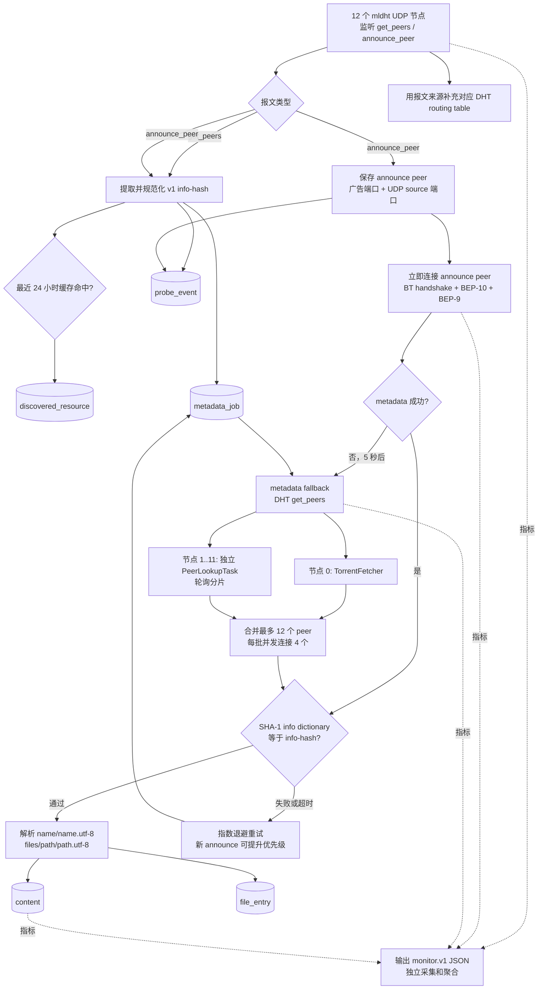
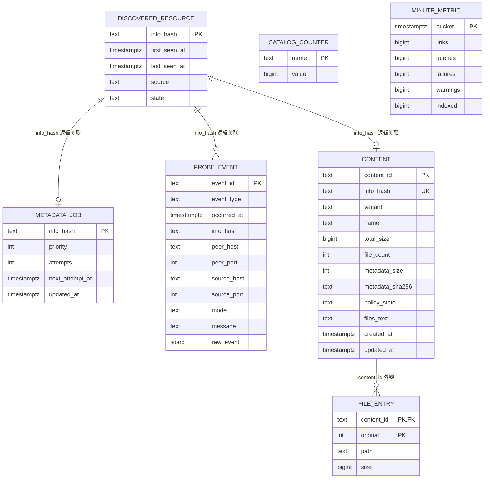

# DHT 种子名称采集原理与数据结构

本文描述 Java 版 `dht-collector` 当前实现。生产链路只发现 v1 info-hash、
获取并校验 BEP-9 metadata，不下载任何种子内容分片。

## 1. 名称到底从哪里来

Mainline DHT 的 `get_peers` 和 `announce_peer` 报文本身不包含种子名称：

- `get_peers` 提供 info-hash 和请求来源。
- `announce_peer` 额外提供一个当前 peer 的 TCP 端口。
- 名称、文件路径和文件大小来自 peer 返回的 BEP-9 `ut_metadata`。
- 收到 metadata 后，程序对原始 info dictionary 做 SHA-1；只有结果等于目标
  info-hash 才会解析名称并入库。

因此“更快获取种子名字”的核心不是增加数据库搜索速度，而是更快拿到仍在线、
支持 BEP-10/BEP-9 的 peer，并避免 DHT lookup 在单节点任务队列中饥饿。

## 2. 当前处理流程



### 2.1 快路径：`announce_peer`

1. 保存对方广告的 TCP 端口；由于 mldht 未暴露 BEP-5 `implied_port`，UDP
   source 端口作为第二候选。
2. 新任务以优先级 `100` 入库，并立即占用一个 metadata permit。
3. 对最多 6 个近期 announce endpoint 发起连接；单次直接尝试最长 10 秒。
4. 成功后立即校验、解析并写入 `content`/`file_entry`；失败则 5 秒后进入
   DHT fallback。

### 2.2 回退路径：DHT peer lookup

1. 普通 `get_peers` 发现的任务优先级为 `10`，announce fallback 为 `100`。
2. 节点 0 专用于 `TorrentFetcher`。该库只有在自己的 RPC task queue 为空时
   才启动 lookup，因此不能再向节点 0 塞入独立 lookup。
3. 独立 `PeerLookupTask` 在节点 1..11 之间轮询，避免 96 个 metadata worker
   全部堆到一个 task manager。
4. 找到 peer 后等待最多 500 ms 收集候选；满 12 个则提前停止 lookup。
5. `DirectMetadataFetcher` 每批并行尝试 4 个 peer，最多尝试 12 个。

### 2.3 并发和持久化

- `--max-concurrent=160`：限制 info-hash 观察处理。
- `--metadata-concurrent=96`：限制 metadata 工作总数。
- Java 21 virtual threads 承载阻塞式数据库和 TCP 操作。
- HikariCP 当前最多 5 条 PostgreSQL 连接，启用 TCP keepalive、1 分钟连接
  保活和 10 分钟最大生命周期。
- 只有最近 24 小时出现的 resource 常驻内存；更老的数据按需访问数据库。
- metadata job 在执行前持久化，进程重启后可继续；失败采用指数退避，最长
  7 天，新 announce 可重新加速。

## 3. 数据库关系



除 `content -> file_entry` 外，图中的 info-hash 关系是应用层逻辑关系，不是
数据库外键。这样高吞吐事件写入不会被大表外键检查放大。

## 4. 表结构与关键索引

| 表 | 用途 | 主字段 | 关键索引 |
| --- | --- | --- | --- |
| `discovered_resource` | info-hash 生命周期和去重 | `info_hash`, `first_seen_at`, `last_seen_at`, `source`, `state` | PK `info_hash`; `(state,last_seen_at)` |
| `metadata_job` | 可恢复 metadata 队列 | `info_hash`, `priority`, `attempts`, `next_attempt_at`, `updated_at` | PK `info_hash`; `(priority DESC,updated_at DESC,next_attempt_at)` |
| `probe_event` | 发现、peer、metadata 结果事实 | `event_id`, `event_type`, `occurred_at`, endpoint 字段, `raw_event` | `(occurred_at DESC)`; `(info_hash,occurred_at DESC)`; peer partial covering index |
| `content` | 已校验的种子级 metadata | `content_id`, `info_hash`, `name`, 大小/文件数, `files_text`, 时间 | unique `info_hash`; `updated_at`; 名称和文件文本 GIN |
| `file_entry` | 单文件路径和大小 | `content_id`, `ordinal`, `path`, `size` | PK `(content_id,ordinal)`; path GIN |
| `catalog_counter` | 避免 dashboard 实时全表计数 | `name`, `value` | PK `name` |
| `minute_metric` | 趋势图分钟聚合 | `bucket`, 五类计数 | PK `bucket` |

2026-08-14 的 PostgreSQL 统计估算：

| 表 | 估算行数 | 含索引总大小 |
| --- | ---: | ---: |
| `content` | 87,022 | 367 MB |
| `file_entry` | 3,172,271 | 1,155 MB |
| `discovered_resource` | 2,036,099 | 580 MB |
| `metadata_job` | 1,895,738 | 619 MB |
| `probe_event` | 7,376,786 | 4,669 MB |

这些数字解释了为什么 dashboard 必须读取 `catalog_counter`/`minute_metric`，
不能在请求时对事实表执行全表 `count(*)`。

## 5. 脱敏数据示例

以下样例保持实际字段形态；hash 已截断，peer 使用文档保留地址。

### `discovered_resource`

```json
{
  "info_hash": "1e8b4ea9...",
  "first_seen_at": "2026-08-14T13:39:35Z",
  "last_seen_at": "2026-08-14T13:39:50Z",
  "source": "announce_peer",
  "state": "active"
}
```

### `metadata_job`

```json
{
  "info_hash": "1e8b4ea9...",
  "priority": 100,
  "attempts": 1,
  "next_attempt_at": "2026-08-14T13:39:55Z",
  "updated_at": "2026-08-14T13:39:50Z"
}
```

### `probe_event`

```json
{
  "event_id": "5aa844bc-...",
  "event_type": "dht.peer_discovered",
  "occurred_at": "2026-08-14T13:39:50Z",
  "info_hash": "1e8b4ea9...",
  "peer_host": "198.51.100.24",
  "peer_port": 51413,
  "source_host": "198.51.100.24",
  "source_port": 49001,
  "mode": "passive"
}
```

### `content`

```json
{
  "content_id": "btih:1e8b4ea9...",
  "info_hash": "1e8b4ea9...",
  "variant": "v1",
  "name": "Some Kind Of Heaven (2020) [720p] [WEBRip] [YTS.MX]",
  "total_size": 797357436,
  "file_count": 3,
  "policy_state": "approved",
  "created_at": "2026-08-14T13:39:51Z"
}
```

### `file_entry`

```json
[
  {
    "content_id": "btih:1e8b4ea9...",
    "ordinal": 0,
    "path": "Some.Kind.Of.Heaven.2020.720p.WEBRip.x264.AAC-[YTS.MX].mp4",
    "size": 797217021
  },
  {
    "content_id": "btih:1e8b4ea9...",
    "ordinal": 1,
    "path": "Some.Kind.Of.Heaven.2020.720p.WEBRip.x264.AAC-[YTS.MX].srt",
    "size": 87189
  }
]
```

## 6. 本次性能诊断与改动

2026-08-14 采样的最近 30 分钟内：

- 收到 45,681 个 DHT 查询，发现 7,880 个新 info-hash。
- direct metadata 成功 15 次、miss 1,309 次。
- 发起 2,658 次 DHT fallback，`TorrentFetcher` 仅完成 1 次。
- 最终新增 17 条 `content`，成功率明显受 peer 可用性和 lookup 调度限制。
- PostgreSQL 曾发生约 68 秒连接中断，造成 217 次连接池等待超时。

代码检查确认，旧实现的独立 `PeerLookupTask` 每次都选择列表中的第一个 DHT
节点。该节点同时被声明为 `TorrentFetcher` 的专用节点，结果是独立 lookup
持续占据 task queue，而 `TorrentFetcher` 又要求该 queue 为空，二者互相影响。

本次改动：

1. 节点 0 只供 `TorrentFetcher` 使用。
2. 独立 lookup 在节点 1..11 之间轮询，并在当前节点不可用时继续尝试后续节点。
3. 新增 `metadata.dht_tasks_active`、`metadata.dht_tasks_queued` 指标，用于验证
   task manager 是否继续积压。
4. PostgreSQL 池增加 TCP keepalive、1 分钟 Hikari keepalive、10 分钟连接
   生命周期和 3 秒 validation timeout。

部署后至少观察 30 分钟，并比较：

- `metadata.dht_library_completed / metadata.dht_fetch_started`
- `metadata.dht_direct_completed / metadata.dht_fetch_started`
- `content.indexed` 每分钟增量
- `metadata.dht_tasks_queued` 是否持续增长
- `collector.failed` 和连接池 timeout 是否归零

若轮询分片后依旧没有 DHT peer 回调，下一步只对 priority `100` 的实时任务做
双节点 hedged lookup；不要先全局增加 metadata concurrency，否则只会扩大 UDP、
TCP 和数据库压力。
